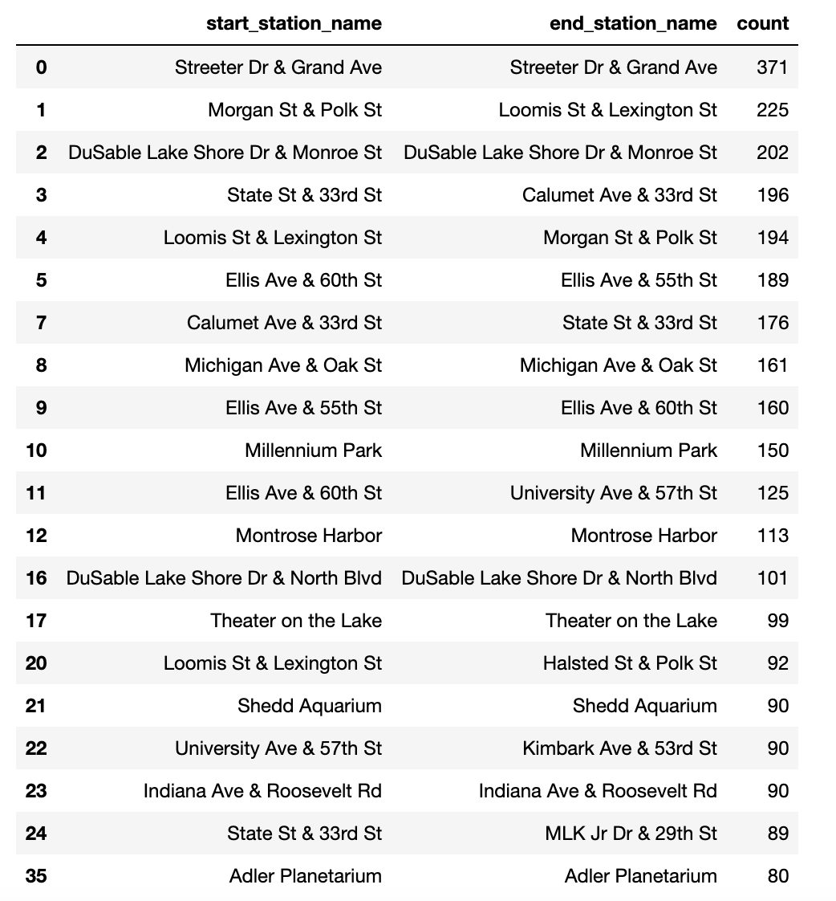
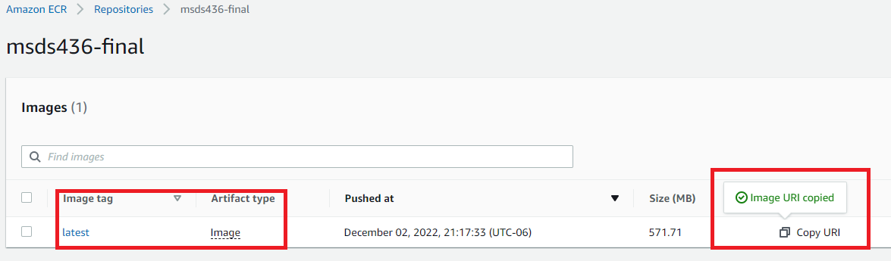

# MSDS436 - Final Project
This repository contains code used for MSDS 436 Final Project

## Table of Contents
- [Introduction](#introduction)
- [About the Data](#about-the-data)
- [Requirements](#requirements)
- [Project Details](#project-details)
- [Architecture](#architecture)
- [EDA](#eda)
- [Project Limitations](#project-limitations)
- [Future Enhancements](#future-enhancements)
- [Project Owners](#project-owners)

## Introduction
As a leading bike share service in the city of Chicago, [Divvy's data](https://ride.divvybikes.com/system-data) offers unique opportunities to model human flow patterns.
Our internal team will leverage Divvy's data to create insights into human movement in Chicago.

These insights will directly increase Divvy's enterprise value through internal projects and resale opportunities.

## About the Data
### Divvy Ride Data

The Divvy bike data set is provided by Divvy on a monthly bases and can be found on [their website](https://ride.divvybikes.com/system-data).

The data contains trip information such as:
- Trip start day and time
- Trip end day and time
- Trip start station
- Trip end station
- Rider type (Member, Single Ride, and Day Pass)

For our use case, we have limited the data set to only the month of September 2022 and rides that only have a start and end station. 
We have also taken a random sample of 5,000 rides per day.

### Open Source Routing Machine (OSRM) API

To get estimated trip time, we used the [OSRM API](http://project-osrm.org/docs/v5.10.0/api/#general-options). This API combines sophisticated routing algorithms with the open and free road network data of the OpenStreetMap (OSM) project. To calculate the shortest path for a bike ride, we pass the start and end station's latitude and longitude to return the estimated duration (in seconds) and distance (in meters).

### OpenWeather API

To gather historical weather data, we used [OpenWeather's One Call API](https://openweathermap.org/api/one-call-3#data). 
            
We gathered the following data points from the API:
- Temperature (in Fahrenheit)
- Humidity
- Wind Speed
- Weather
- Precipitation of rain/snow

Due to the cost per call model, we decided to limit our cost by only using the latitude and longitude of the center of Chicago (41.87, -87.62) and only pulling back 24 hours of data per day (total of 720 API calls).

## Requirements
- [API Key from OpenWeather](https://openweathermap.org/api/one-call-3)
- [AWS Account](https://aws.amazon.com/)
- [PostgreSQL (Desktop)](https://www.postgresql.org/)
- [Docker (Desktop)](https://docs.docker.com/get-docker/)
- [requirements.txt](https://github.com/DrakeData/MSDS436-FINAL/blob/main/requirements.txt)

## Project Details
For this project, we will be building an end-to-end process of gathering, preparing data for Machine Learning (ML) modeling using AWS platform, Python, and Spark. 

Below are the steps we have taken to build out this project:

### Step 1: Gather the data
We first needed to extract the necessary data from Divvy's website, make API calls to OSRM and OpenWeather API, and clean the data set

### Step 2: Load csv file into AWS S3 Bucket
To create an Amazon Simple Storage Service (S3) bucket, we needed to set up an [AWS account](https://aws.amazon.com/) and then [setup the S3 bucket](https://www.sqlshack.com/getting-started-with-amazon-s3-and-python/). The bucket name for our S3 bucket is `msds436-final`. 

Using Python, we were able to automate this process to load the created csv files into our S3 bucket. The Python script creates a folder called `files` in the S3 bucket and saves the csv file in it.

**Python example:**

**File in S3:**

### Step 3: Spin up PostgreSQL server to use as our Data Lake (DL), create a relational data model and load the curated data from S3 buckets.

- To spin up a PostgreSQL server, follow this helpful AWS resources: 
    * Document: [Create and Connect to a PostgreSQL Database
with Amazon RDS](https://aws.amazon.com/getting-started/hands-on/create-connect-postgresql-db/)
    * YouTube Video: [AWS RDS Aurora Postgres Database Setup | Step by Step Tutorial](https://youtu.be/vw5EO5Jz8-8)

**NOTE:** Make sure to add these inbound security rules:
    

- Once your PostgreSQL server is available, open up pgAdmin and add a new server.

- Using pgAdmin Query Tool, install `aws_commmon' by run:
    
        CREATE EXTENSION aws_s3 CASCADE;

- Then create table called `bike_data`:
       
        CREATE TABLE bike_data (ride_id varchar(120) primary key,
					rideable_type varchar(120) NOT NULL,
					started_at date,
					ended_at date,
					start_station_name varchar(120) NOT NULL,
					start_station_id varchar(120) NOT NULL,
					end_station_name varchar(120) NOT NULL,
					end_station_id varchar(120) NOT NULL, 
					start_lat numeric,
					start_lng numeric,
					end_lat numeric,
					end_lng numeric,
					member_casual varchar(120),
					started_at_clean date,
					duration numeric,
					distance numeric,
					started_at_unix integer,
					temp numeric,
					hum numeric,
					windsp numeric,
					weather varchar(120),
					rain numeric,
					snow numeric
					);
    
- Using pgAdmin, load data from S3 to Postgres

        SELECT aws_s3.table_import_from_s3('bike_data', 'ride_id,rideable_type,started_at,ended_at,start_station_name,start_station_id,end_station_name,end_station_id,start_lat,start_lng,end_lat,end_lng,member_casual,started_at_clean,duration,distance,started_at_unix,temp,hum,windsp,weather,rain,snow',
        '(format csv, header true)',
        'msds436-final',
        'files/202209_divvy_distance_weather.csv',
        'us-east-2',
        'YOUR_AWS_ACCESS_KEY', 
        'YOUR_AWS_SECRET_KEY' 
        );

- You will now be able to query the DL using Python.

**EXAMPLE:**

### Step 4: EDA
**NOTE:** EDA was performed in PySpark and Pandas.

The above snip of code demonstrates initial statistics of the Divvy dataset, processed using Spark. Spark was used to level-set on feature characteristics before executing data cleansing, wrangling, and feature enrichment.

This image represents the initial reference points for historic Chicago. Madison St and State St serve as zeroed lines of demarcation from which Chicago is divided East/West and North/South. While this would be one method in quadrant-izing the map, there are more accurate ways to measure distribution, in order to create quadrants with more balance.

In assessing the best way to create ride activity quadrants, Madison St and State St were juxtaposed with the Divvy dataset's mean latitude/longitude values, as well as the 50% quartile values. All 3 are overlaid onto the starting point distribution as shown. Ultimately, the mean value was chosen to represent an initial quadrant approach, as it is the most agile metric, given that ride activity could shift in the future.

This histogram series represents volume of ride time (in seconds) for each of the membership classes, binned by time difference (actual minus predicted. The key insight here is to realize that casual rides carry a much longer right tail of positive time difference, meaning casual riders seem to represent a majority of human flow "peddle-meddling".

These histograms show volume of ridetime per each bike type, and demonstrate how bike type affects time difference assessments. Unsurprisingly, classic bikes were the most popular, and electric bikes carried an average time_diff value below zero, meaning the average ride went faster than predicted. Additionally, docked bikes do not bear much volume weight. This would be interesting data to juxtapose with Divvy's fleet sizes of each bike class, to assess usage and rider preference as opposed to what's available.

The ride datetime vs. actual time and predicted time proved to be a key visualization in understanding holistic Chicago cycling trends. In general, most Chicago bikers are efficient with their travel - times are less than the OpenStreetMap predicts. However, on weekends, folks seem to flip that trend, taking considerably more time than the estimated travel time predicts. Additionally, on a daily weekday basis, there appears to be moderate travel in the mid-morning hours (7-9am) and moderate travel also occurs in the evenings (5-7pm). The giant travel block mid-Sept 22nd may be due to a White Sox home game!

The above table demonstrating which routes are the most popular. Nearly all are located in the main Chicago downtown area. Several of the top 20 are loops, which could indicate a leisurely weekend ride, a quick errand, or perhaps, in large time difference occasions, a workday commute. Looped routes also make human flow estimation more difficult, as time passage is the only variable that still contributes to potential paths cycled.

This sunburst chart demonstrates the distribution across membership class, starting bike station, and day of week. We can see large demand in the main metro area (Streeter Dr, Grand Ave, DuSable Lake Shore, Monroe St, etc...) on Saturdays and Sundays for casual riders, while members appear to utilize the bikes for workday commutes. Additionally, we can see which stations have the most demand across all days, while others only carry demand for some days.

Much like the day of week version, this sunburst indicates which times of day show the most traffic, per member class and starting station. Interesting points to show here include the apparent fact that members span a larger station list than casual rides do, and key hours appear to be 6-9am, and 3-6pm.

This sunburst simply indicates which stations are most important (aka most used) per quadrant. Again, given that this is a PoC to showcase the ability to box-in key areas of interest, this is an important distinction to understand what station resources are contributing to human flow, and which are not.

### Step 5: Run models
#### Station Optimization
The first ML objective of the project was to use divvy ride and weather data to identify opportunities for internal cost savings, and to predict station over and under supply to anticipate bike transfer needs.

To identify internal cost saving opportunities, we aggregate daily departures and arrivals by station for the month of September. We then collect the maximum daily departure and maximum daily arrival for each station, and identify stations with a maximum departure and arrival of less than or equal to two for the entire month of September. We identify these stations as “low-traffic stations,” and export this list of 480 stations for consideration for closure. To make a final decision, however, we recommend an analysis of year-round data to account for seasonal trends that may influence station usage.

To anticipate bike transfer needs, we identify mid- to high-traffic stations using the same methodology as explained above. We focus the remainder of our analysis on these higher traffic stations, assuming their traffic will contribute to station supply and shortage most meaningfully. In total, 481 stations were selected.

After correlation and autocorrelation analysis the following predictive features were selected for the model: weekday (binary), average daily temperature, average daily windspeed, total daily rain, day of the week, one-day ride count lag, two-day ride count lag, and a one-hot encoding of a weather description (“clear”, “clouds”, “drizzle”, “mist”, “rain”, “thunderstorm” and “smoke”).

Two ordinary least squares regression was performed on each station: one for daily arrivals and one for daily departures. These predictions were pushed into a single data frame and their differentials calculated. The forecasted differential identifies stations with a predicted overage supply, and stations with a predicted bike shortage—these forecasts will inform bike relocation efforts, and prevent lost rental opportunities due to bike shortage at high-demand stations.

We recommend the next step of this project be to use the latitude and longitude station data to identify station proximity, and recommend bike movement between stations with overage and shortage within close physical proximity—furthering cost saving efforts.

#### Human Flow
The purpose of utilizing machine learning for Chicago bicycle travel is to predict ride time for any given start/end station, day, time, and quadrant of interest. An actual ride time that has a significantly higher value than predicted ride time can be used to indicate propensity-to-buy. When overlaid with thousands of other trips, common routes can be established in order to highlight areas for business investment, marketing strategies, and low-hanging fruit pedestrian sales opportunities. This is additionally substantiated by the large volume.

A small (n_estimators = 10, random_state = 10) randomforest model was selected as an initial, simple model to demonstrate effectiveness of concept, given onehotencoded data that included: bike type, member class, predicted time, historical time differences, temperature, quadrant, start hour, and end hour. Actual time was the target variable. The model performed with 72.667% accuracy on the test data set, despite relatively low correlation between variables, and relatively low feature importance. 

### Step 6: Results
For every mid to high traffic station, we have a departure and arrival forcast. We calulate the difference and deploy it as the forecasted surplus/shortage.

#### Bike Surplus Data Frame

#### Bike Shortage Data Frame

### Step 7: Build and Deploy Streamlit Application
### Pushing Docker Image in AWS
- Download [Docker](https://docs.docker.com/get-docker/) for desktop and open it when download. Docker needs to run in the background for the following to work.
- Download the [AWS CLI Tool](https://docs.aws.amazon.com/cli/latest/userguide/getting-started-install.html) for desktop.
- In the command line, set your AWS Key ID and AWS Key buy running:
		
		aws configure

- Grab the first part of the push commands that AWS provides

**NOTE:** Refer to [this part of the video](https://youtu.be/Jc5GI3v2jtE?t=208) if you run into access issues.

- Build Docker Image (make sure you are in the same directory as the Dockerfile built)
			
			docker build -f Dockerfile msds436-final-app:latest .

- Tag the image created

		docker tag msds436-final-app:latest public.ecr.aws/k3u1k7f7/msds436-final:latest

- Lastly, push the image

		docker push public.ecr.aws/k3u1k7f7/msds436-final:latest 

Once the image is pushed, you will see it in your AWS repository. Note that you will want to copy the URI to create the ECS cluster (found in Elastic Container Service).

- Create cluster, then go to 'Task Definitions'
	* Create new Task Definition
	* Select EC2
	* Enter name of Definition, Task memory = 1024, and Task CPU = 256
	* Then click on 'Add container', enter name and past URI that you copied into the 'Image' box
	* Set port mappings as: 80 850
	* Leave everything else as is and click 'Add'

- Leave the rest of the Task Definition as default and click create
- Go back to the cluster and assign the task ([see video](https://youtu.be/Jc5GI3v2jtE?t=657)).
- Go to EC2 Dashboard, click on 'Instances', then open the public URL. Your streamlit app should now be deployed.

### Step 8: Recommendations and Next Steps
#### Data Collection
1.  API Limits
	- OpenStreetMap's API has consumption limits for free users, and limited feature sets as well. Given cost constraints for this project's PoC phase, a future state would include integrating more advanced data available from Divvy with recommended map route features that OpenStreetMap provides, in order to actually demonstrate common paths of human flow.
2. Data Volume
	- This PoC was limited to 150,000 ride instances, spanning a randomized selection of 5,000 rides per day through September 2022. Consuming a much larger data volume would introduce the ability to assess realistic ride trends on a time basis, as well as enrich existing data explorations.
3. Feature Engineering
	- Additional considerations for feature engineering include adding in more weather variables, lag time variables for weather, seasonality, holidays, major events, and bike station proximity to large traffic entities (like the U of Chicago). 

#### Model
1. Model Simplicity
	- Computational resources and cost constraints limited the type of modeling that was possible to explore for this project, and the model was not tested on future data. In the future, utilizing more advanced models would be an ideal path to boost performance.
2. Model Accuracy
	- Leveraging a dataset that is thousands of times larger than the current scope would enable a model many more reference points from which to predict human flow on a time/place basis.
3. Model Usability
	- Once a more robust model is built, high-traffic, high-time-difference areas within the Chicago area can be assessed for propensity-to-buy mapping, enabling B2C investors or current business owners insights into the who, when, and where of potential bicyclist customers. 

## Architecture
The architecture shown below represents a combination of Proof-of-Concept (PoC) structure and eventual production environment. The established architecture is a skeleton for scalable project value delivery. Current project state includes local consumption of static data, locally-developed and tested models, a GitHub repository for initial DevOps management, and a Docker-containerized public deployment via Streamlit and the AWS cloud.

Future state would include additional DevOps functionality, as well as cloud-based MLOps tool utilization for model monitoring, infrastructure auto-scaling, and backend model artifact API delivery.

## Project Limitations
Due to being on a student budget, we errored on the side of caution of limiting our expenses, which affected our project’s performance. Please see 'Future Enhancements' for what we would want to do next to enhance what we have built.

## Future Enhancements
- Automate the monthly Divvy data pull in AWS and load the data into our Postgres Data Lake.
- Build out APIs using Postman to connect tot other AWS services, such as SageMaker.
- Enhance resources on our EC2 bucket so that our Streamlit app runs faster and can run real-time machine learning models.

## Project Owners
- [Katie Gaertner](https://github.com/katiegaertner)
- [Carlin Gerstenberger](https://github.com/carlin-gerstenberger)
- [Nicholas Drake](https://github.com/DrakeData)
